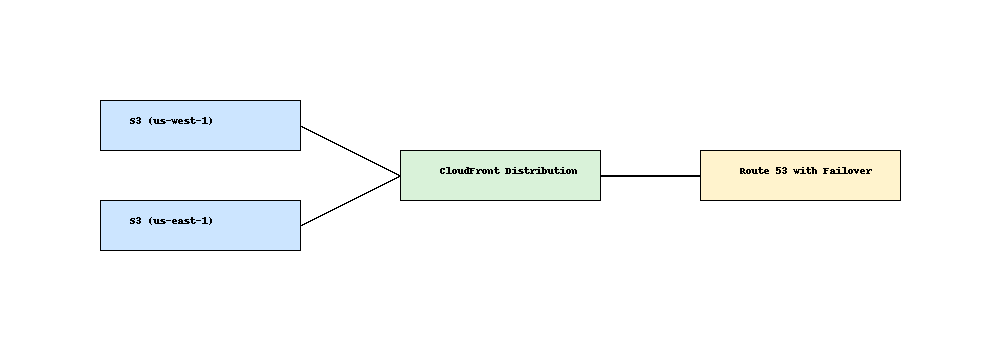

# Multi-Region Website Infrastructure 🌍🗂️

This project sets up a static website with high availability using:

- Amazon S3 (Primary + Secondary buckets)
- CloudFront (CDN)
- Route 53 (Failover routing + health checks)
- Terraform (IaC)

## 🗺️ Architecture



## 📁 Structure

- `terraform/` – Terraform scripts for S3, CloudFront, Route 53
- `README.md` – Overview and deployment instructions

## 🚀 Deploy

```bash
cd terraform
terraform init
terraform apply
```

## 🔧 Notes

- You must manually upload content to each S3 bucket after deployment.
- Route 53 failover relies on health checks to redirect traffic from primary to backup.

